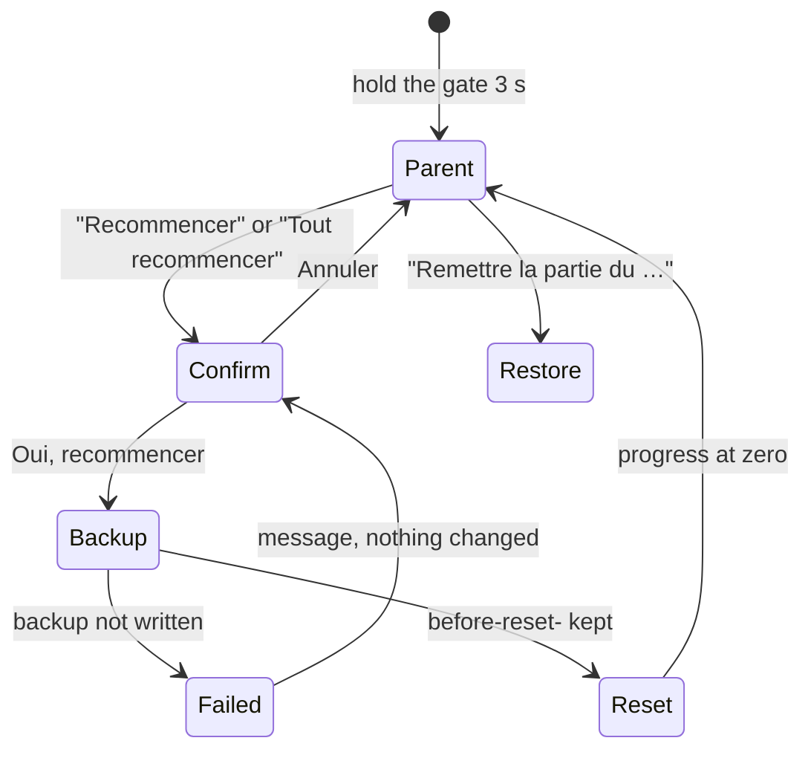

# Engine c1 — worlds screens, storage fix, resets

- **Scope:** engine step c1b (screens) + the storage fix before it.
- **Step:** c1b (checkpoint). **Branch:** `dev`. **Status:** built, waiting for review.
- **Base commit:** 0ccde95. Commits: `5bb0468` storage fix, `739fd4e` c1b.
- **Reviewed range (pwa-guardian):** `4ea9a00..739fd4e` (c1a + tools patch + storage fix + c1b).
- **Model:** Opus 5.5; subagents: pwa-guardian → Sonnet.
- **Usage consumed:** ~223 k tokens of context; plan 38 % (5-hour) / 66 % (weekly), app usage tool.
- **Full-gate runs:** 1 (23.6 min), PASS. No rerun. After it, one CSS rule changed (see Risks).
- **Reviewer findings:** pwa-guardian: 1 (fixed 1, open 0).
- **Questions for review:**
  1. A v3 app (preview.2) that earns items after the v4 migration: those items are not merged. Accept?
  2. A world tile shows the world's background only, not the child's placed items. Keep it simple?
  3. The overlay CSS fix ran after the full gate. Let the c2 full gate cover it?

Read list: `engine-plan.md` (c1b row, owner's changes, §5); `engine-packs-migration.md` §1–2;
`js/storage.js`, `js/scene.js`, `js/rewards.js`, `js/items.js`, `scenes/meadow/pack.js`,
`scenes/registry.js`; `js/screens/` scene, hub, collection, parent, checks; `js/app.js` 1–40;
`tests/storage.test.mjs`; i18n and CSS by grep and line ranges.

## 1. Storage fix (commit `5bb0468`)

Problem: the released v0.9.0 app rewrites `rewards` as `{ stars, stickers }` on every star.
c1a kept `items`, `nextAt` and `news` inside `rewards`. The repair then rebuilt them from the
frozen v3 `scene` and overwrote `worlds.meadow.placed`.

Fix: `items`, `nextAt` and `news` move to `profile.collection`. `rewards` keeps the v1 shape.
Repair on load creates `collection` or `worlds` only when missing. It never overwrites a field.

| field | written by (app versions) | read by | migration |
|---|---|---|---|
| `rewards` `{ stars, stickers }` | v0.9.0 and every later version | every version | 1→2: written out |
| `skills` | schema 2+ | `js/progress.js` | 1→2: `{}` |
| `fixedMap` | schema 2+ (parent screen) | parent screen | 1→2: `false` |
| `scene` | schema 3 only (preview.2) | the v4 repair only | 2→3: `startScene` |
| `collection` `{ items, nextAt, news }` | schema 4+ (`js/rewards.js`, worlds screens) | rewards, worlds screens | 3→4 + repair when missing |
| `worlds` `{ unlocked, <id>: { placed } }` | schema 4+ (`js/rewards.js`, scene screen) | rewards, worlds screens | 3→4 + repair when missing |

- In memory, `getRewards()` merges `rewards` + `collection`. `setRewards()` splits them again.
- A c1a-shape save (dev only) is moved to the new shape on load.
- New test: v4 save → the v0.9.0 code adds 3 stars and a sticker, and 1 star on the other
  profile → v4 load. Result: `collection`, `worlds`, placements and `scene` are unchanged.
  The old app's stars and sticker are kept. This test fails on the c1a code.

## 2. c1b (commit `739fd4e`)

- **"Mes mondes"** (`js/screens/worlds.js`): the album's meadow button becomes the worlds
  button. One tile for each pack. A locked world is a grey "?".
- **Free world screen** (`js/screens/scene.js`): it reads a pack. Params: `{ profileId, world }`.
  The tray shows the items of that world only. Opening a world clears only that world's news.
- **Wiggle and voice for each world:** the hub album button and the worlds button wiggle while
  there are news. The tile of each world with news wiggles. The voice names that world.
- **Unlock reveal:** a game's first star shows the new world's scene with the gift item.
- **Resets** (parent screen): "Recommencer à zéro" in the profile edit card. "Tout recommencer
  à zéro" in the Save card (the Save card now always shows when a profile exists).
- `getScene` / `setScene` are removed.
- **Shell layout cases:** worlds grid, full free world, world reveal, both reset confirms.

A reset clears `games`, `skills`, `rewards`, `collection`, `worlds` and the v3 `scene`.
It keeps `id`, `name`, `avatar`, `readingLang`, `unlockAll` and `fixedMap`.

Contact sheet (360 × 640): `engine-c1-worlds.png`.

## 3. Reviewer findings

- pwa-guardian, low, fixed: the c1a-shape repair could write `nextAt: undefined`. Then the
  next reward never comes. The repair now falls back to the v3 `nextAt`.

## 4. Risks

- The world reveal was not centred at 360 px: the rays widened the overlay's grid cell. One
  rule in `.sticker-overlay` (shared CSS) fixes it. The sticker and item reveals use it too.
  The check after the fix: unit, privacy, offline PASS, and the contact sheet. The layout
  check did not run again.
- Only the meadow pack exists. The worlds grid has one tile until Train adds its pack.
- A reset needs space for one more full copy of the save. On a full device it fails and
  says so. Nothing changes.
- Not checked by the gate: the real touch feel, the voice lines on a device.

## 5. Owner actions

- Open the preview `0.9.0-preview.3` on a phone. Open "Mes mondes" from the album.
- Test one reset on the preview. Restore it from the Save card.
- Reply to the 3 questions.
