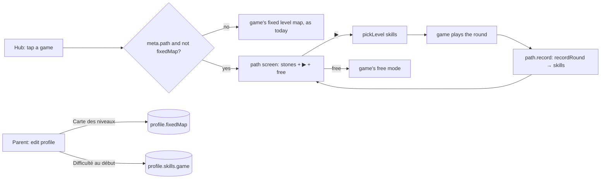

# Engine c2 — path screen, parent switch, clear Save card

- **Scope:** engine step c2 (E3b) + Save card wording + free-world measurement + backlog.
- **Step:** c2 (checkpoint). **Branch:** `dev`. **Status:** **stopped by the context-budget hook (150 k)** — built, quick gate green; full gate still running when stopped.
- **Base commit:** 530664b. Commits: `5f4e69d` c2, `9e2c7de` PRECACHE (js/path.js).
- **Reviewed range (pwa-guardian):** `739fd4e..HEAD`.
- **Model:** Opus 5.5; subagents: pwa-guardian → Sonnet.
- **Usage consumed:** ~150 k tokens of context (hook block).
- **Context-budget hook:** yes, it warned at 121 068 tokens (right after the read list) and blocked at 150 236.
- **Full-gate runs:** 1 started 16:25, result not read (log: %TEMP%c2-gate.log in the main checkout). Quick gate (unit, privacy): PASS.
- **Reviewer findings:** pwa-guardian not run (budget). Contact sheet not made (script ready in the session scratchpad: c2-sheet.mjs).
- **Questions for review:**
  1. "Reset difficulty" puts the skill back to step 1 and clears `seen`; the stones
     (`rounds`) and `best` stay (the child's path never shrinks). OK?
  2. Version backups have no date, so they go **last** in the list (newest version
     first). OK?
  3. The date is "05/10/2026, 14:10" in all three languages (en included, day first). OK?

Read list: `engine-plan.md` (c2 row, §5); `engine-packs-migration.md` §3;
`js/screens/parent.js`; the Save strings in `js/i18n/*.js` (grep); then
`js/progress.js` 24–63, `js/screens/game.js`, `js/screens/checks.js`, `js/storage.js`
200–230 / 262–311 / 340–391, grep in `css/base.css`, `js/icons.js`, `tools/check-kit.mjs`.

Note: this worktree started on `main`; I reset it to `dev` (530664b) before any work.
`tools/` is write-blocked here (no `private-words.txt`), so the gates ran in the main
checkout on `dev`, fast-forwarded to my commits.

## 1. E3b — path screen + parent switch

- `js/path.js` — `createPath(profileId, gameId)` → `{ show(container, { levels, onPlay,
  onFree }), record(level, strongestHint, levels) }`. ▶ calls `onPlay(pickLevel(…))`;
  `record` saves `recordRound(…, outcomeOf(hint))`. Stones = rounds played (last 24
  drawn, the newest pops in), no numbers. Free mode = its own round button next to ▶.
- `js/screens/game.js` — `ctx.path` = path object for a game whose meta has
  `path: true` **and** whose player has `fixedMap` off; else `null` (the game shows its
  map). No game opts in yet.
- Parent → edit profile: "Carte des niveaux" yes/no (`profile.fixedMap`), and one
  "Difficulté au début : <jeu>" button per path game (confirm screen) →
  `storage.resetSkill`.

Stored data (no schema change — both fields exist since schema 2):

| field | written by | read by | change in c2 |
|---|---|---|---|
| `profile.skills[gameId]` `{skill,best,rounds,seen}` | `path.record`, `resetSkill` (new) | `path.show`/▶ (`pickLevel`) | first writer; reset = `skill 1, seen []`, keeps `rounds`, `best` |
| `profile.fixedMap` | parent edit (new row) | `game.js` → `ctx.path` | first reader/writer |

## 2. Save card

One list, newest first (kept saves by date, then the update backups, newest version
first), an intro line, and the confirm screen shows the same name in bold. Labels come
from the existing backup keys; no storage change.

| key | fr | es | en |
|---|---|---|---|
| saveIntro | L’application garde des copies de la partie. Touchez une copie pour y revenir : la partie actuelle est gardée aussi. | La aplicación guarda copias de la partida. Toque una copia para volver a ella: la partida actual también se guarda. | The app keeps copies of the game. Tap a copy to go back to it: the current game is kept too. |
| keptReset | Avant « Recommencer à zéro » — {when} | Antes de «Empezar de cero» — {when} | Before “Start again from zero” — {when} |
| keptRestore | Avant une restauration — {when} | Antes de una restauración — {when} | Before a restore — {when} |
| keptCopy (preview) | Avant la copie — {when} | Antes de la copia — {when} | Before the copy — {when} |
| keptUpdate | Avant la mise à jour de l’application | Antes de la actualización de la aplicación | Before the app update |
| keptUpdateN (>1) | Avant la mise à jour de l’application (ancienne version {n}) | Antes de la actualización de la aplicación (versión anterior {n}) | Before the app update (old version {n}) |
| confirmRestoreCopy | Revenir à cette copie de la partie ? | ¿Volver a esta copia de la partida? | Go back to this copy of the game? |
| (then the name, bold) | | | |
| confirmRestoreNote | La partie actuelle est gardée aussi : elle apparaîtra dans la liste. | La partida actual también se guarda: aparecerá en la lista. | The current game is kept too: it will appear in the list. |

`{when}` = `05/10/2026, 14:10`. Removed: `restoreBackup`, `confirmRestore`, `restoreKept`,
`confirmRestoreKept`. New c2 strings: `pathPlay` Jouer / Jugar / Play, `pathFree` Jeu
libre / Juego libre / Free play, `fixedMap` Carte des niveaux / Mapa de niveles / Level
map (+ hint), `resetSkill` "Difficulté au début : {game}" (+ confirm, yes).

## 3. Free world, empty, 360 × 640 (2c — measured, layout unchanged)

Not read yet: the full-gate log prints the line "2c free world 360x640: …".

## 4. Backlog

`engine-plan.md` → "Final touch (after game 9 work)": the parents' note before the first
profile. Not built.

## 5. What the gate can't check

Real touch feel of ▶ / free / the Save list; the path's look with a real game (none
opts in yet — Train is next). Contact sheet: `engine-c2.png` (360 px).
