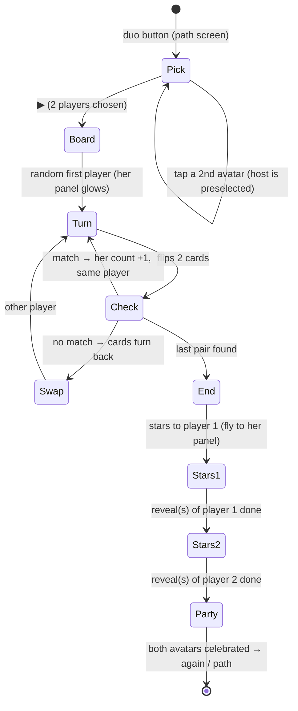

# Game 9 "Duo Mémoire" — design proposal (step M0)

Status: proposal only. No code. The owner decisions 1–7 are fixed and not repeated here.

Read list: GAMES.md (row 9), CLAUDE.md (Level data, report style), games/train/{meta.js,
levels.json, solver.mjs, CLAUDE.md}, js/path.js 1–20, js/rewards.js (addStar, flyStar,
showSticker), js/storage.js (header, exports), js/screens/game.js (ctx.rewards lines),
scenes/registry.js, scenes/meadow/pack.js header, item ids of the 5 packs (grep).

Game id: `memory`. Folder: `games/memory/`.

## a. The 8 path steps

Layout assumptions (M1 measures them with the gate): top bar 72 px, margin 8 px, gap 8 px,
card size cap 140 px (phone) / 160 px (tablet). Usable board at 360×640: 344 × 552 px.
Card size = min((W − gaps) / columns, (H − gaps) / rows).

| step | pairs | look-alike couples | 360×640 grid (card px) | 640×360 grid (card px) | 800×1280 grid (card px) |
|---|---|---|---|---|---|
| 1 | 3 | 0 | 2×3 (140) | 3×2 (132) | 2×3 (160) |
| 2 | 4 | 0 | 2×4 (132) | 4×2 (132) | 2×4 (160) |
| 3 | 5 | 0 | 2×5 (104) | 5×2 (118) | 2×5 (160) |
| 4 | 6 | 0 | 3×4 (109) | 4×3 (85) | 3×4 (160) |
| 5 | 6 | 1 | 3×4 (109) | 4×3 (85) | 3×4 (160) |
| 6 | 8 | 1 | 4×4 (80) | 8×2 (71) | 4×4 (160) |
| 7 | 10 | 2 | 4×5 (80) | 7×3, 1 empty slot (82) | 4×5 (160) |
| 8 | 12 | 3 | 4×6 (80) | 8×3 (71) | 4×6 (160) |

Grid = columns × rows. Landscape tablet (1280×800) and laptop (1366×657) use the
landscape grid; all cards are ≥ 134 px there.

- Every card is ≥ 64 px (MIN_TOUCH) at 360×640. Smallest card at the 3 phone sizes: 71 px
  (step 8, 640×360).
- Maximum that fits: at 360×640 portrait, 4 × 7 cards at 72 px = 14 pairs. At 640×360
  landscape, only 3 rows fit (4 rows = 62 px), and 8 columns = 71 px → **24 cards = 12
  pairs**. So 12 pairs fits at every size. **Cap: 12 pairs.** 13+ pairs fails at 640×360.
- Rounds per ▶: **2** (`roundsPerPlay = 2`). A 12-pair board takes a 6-year-old several
  minutes; 3 boards per ▶ is too long.
- Steps 1–3 use cards from one pack per board (simple, very different items). Steps 4+
  mix 2–3 packs. Steps 7–8 use all 5 packs.
- A card face = the item art (100 × 100 SVG) on a white tile. The card back = one plain
  pattern (CSS + inline SVG, the same for all cards).

## b. Look-alike pairs ("similar items")

A look-alike couple = two different cards that look alike (for example seal and walrus).
Each card still has its own exact twin; the look-alike is a trap only.

Rule A (automatic, engine code): **the same item name in two packs** is a look-alike couple.
From the current ids: `meadow.rabbit`/`party.rabbit`, `meadow.hedgehog`/`party.hedgehog`,
`meadow.flower`/`dinosaurs.flower`, `meadow.pond`/`dinosaurs.pond`,
`meadow.mushroom`/`dinosaurs.mushroom`, `meadow.sun`/`space.sun`.

Rule B (a hand list, level data): couples with different names.
- `arctic.seal` / `arctic.walrus`
- `party.penguin` / `arctic.puffin`
- `meadow.tree` / `meadow.pine`
- `dinosaurs.egg` / `dinosaurs.eggs`
- `space.comet` / `space.meteor`
- `space.planet` / `space.earth`
- `space.star` / `space.constellation`
- `space.ufo` / `space.satellite`
- `meadow.fox` / `arctic.husky`

The owner confirms the list in M1 with a screenshot of each couple (the art may differ
more than the names suggest).

Two uses of the same list:
1. Levels with `lookAlikes: 0` (steps 1–4): a board **never** has both cards of a couple.
   Two different rabbits on one board would look like a mistake, not a trap.
2. Levels with `lookAlikes: n` (steps 5–8): the board has **exactly n** couples. The
   other cards have no look-alike.

## c. levels.json, solver.mjs, gate sampling

```json
{ "schemaVersion": 1, "game": "memory", "levels": [
  { "id": 1, "difficulty": 1, "pairs": 3, "packs": ["meadow", "party"], "packsPerBoard": 1, "lookAlikes": 0 },
  { "id": 8, "difficulty": 8, "pairs": 12, "packs": ["meadow", "dinosaurs", "party", "space", "arctic"], "packsPerBoard": 5, "lookAlikes": 3,
    "lookAlikeList": [["arctic.seal", "arctic.walrus"], ["meadow.tree", "meadow.pine"]] }
] }
```

| field | type | meaning |
|---|---|---|
| `id`, `difficulty` | integer | as every new-engine game (never renumber `id`) |
| `pairs` | integer 2–12 | pairs on the board |
| `packs` | pack ids | packs the cards come from |
| `packsPerBoard` | integer 1–5 | how many of `packs` one board uses (picked at random) |
| `lookAlikes` | integer 0–3 | look-alike couples on the board |
| `lookAlikeList` | pairs of item ids | rule B couples (rule A is automatic); only when `lookAlikes > 0` |

The boards are made at play time by `makeBoard(level, rng)` (pure, in `games/memory/board.js`),
like the train's `makePuzzle`. The game passes `Math.random`; the gate passes a seeded rng.

`solve(level)` → invalid (throws) when:
- an item id in `lookAlikeList` does not exist in the 5 packs, or is not in `packs`;
- `pairs` > the items available after the look-alike exclusions (for the smallest
  `packsPerBoard` choice);
- `lookAlikes × 2 > pairs`, or fewer than `lookAlikes` couples exist in `packs`;
- `pairs` > 12 (the layout cap) or `packsPerBoard` > `packs.length`.
- Returns `{ solvable: true, minMoves: pairs }` (perfect memory, best luck — table only).

`sampleRound(level, rng)` = one board exactly as the game makes it. It throws (the gate
names the level and the seed) when:
- the board does not have 2 × `pairs` cards, or a face is not there exactly twice;
- a `lookAlikes: 0` board has both cards of a couple;
- a `lookAlikes: n` board does not have exactly n couples;
- the board is the same as the previous board (same set of faces) — the "never twice in a
  row" rule of the train.
- Else it returns `{ answers: 1 }`, so the gate's existing loop (seeds 1…200,
  `answers === 1`) runs unchanged.

Hints (owner decision 5) are runtime state, not level data. `tests/memory.test.mjs`
checks the hint counter: a "missed known match" = the child flips card A as the 1st card,
A's twin was seen before (face up once, not matched), and the 2nd card is not the twin.
Miss 1 → nothing, miss 2 → `clue` (the twin wiggles face down), miss 3+ → `glow` (the twin
glows). Outcome for `ctx.path.record` = the strongest hint shown in the round, as Formes.

## d. DUO and the shared code

Facts from the code:
- `addStar(profileId, world)` in js/rewards.js already takes a profile id. It writes that
  profile's `rewards`, `collection`, `worlds` with `setRewardsAndWorlds`.
- The active profile is **not stored**: js/screens/game.js gets `profileId` from
  `app.show('game', { profileId, gameId })` and binds `ctx.rewards.star` to it.
- `flyStar(fromEl, profileId)` flies to the top bar badge and writes that profile's count
  into it.

So the duo needs **no storage change**. Changes:

| file | change |
|---|---|
| js/screens/game.js | new `ctx.players()` → `[{ id, avatar, name }]` of all profiles (the game shows avatars). New `ctx.rewards.starFor(profileId, fromEl, toEl)` → `addStar(profileId, entry.scene)` + fly to `toEl`. Refuses an unknown id. |
| js/rewards.js | `flyStar(fromEl, profileId, toEl = top bar badge)`: optional target; it writes the count only into `toEl`. `showSticker(reward, { avatar } = {})`: optional avatar in a corner of the reveal. |
| games/memory/duo.js | the duo screens (pick, turns, end). Game code only. |
| css/ | only if the reveal avatar needs a shared class. |

The duo is the path's `onFree` button (the path already has it): an icon with 2 avatars,
next to ▶. With 1 profile only, the button is hidden. With "Carte des niveaux"
(`ctx.path` null), the same button is on the level map.

Stored data (field table):

| field | written by (app version) | read by | migration |
|---|---|---|---|
| `profiles[p].rewards` (both players) | v0.9.0+; duo from v0.11.0 via `addStar` | every version | none (same shape) |
| `profiles[p].collection` (both players) | schema 4+; duo via `addStar` | rewards, worlds screens | none |
| `profiles[p].worlds` (both players) | schema 4+; duo via `addStar` | rewards, worlds screens | none |
| `profiles[host].skills.memory` | solo path only, v0.11.0 | js/progress.js | none (new key in an existing map; `getSkill` default) |
| `profiles[p].games.memory` | nothing (the duo stores nothing) | — | — |

**Schema v5: not needed.** No new field and no new shape: the duo writes the existing
per-profile fields through the existing `addStar`. The skill is a new key in `skills`, as
every new-engine game. An older app reads the save unchanged.

Duo flow:



Duo rules (proposal):
- Board: **8 pairs**, no look-alikes, cards from all 5 packs. Duo cap = 10 pairs: at
  640×360 the 2 player panels take 2 × 56 px, and 12 pairs gives 57 px cards.
  8 pairs: 360×640 = 4×4 (80 px, panels on top); 640×360 = 6×3 with 2 empty slots (76 px,
  panels at the sides).
- Turn = the active player's panel (avatar + her pair count) glows; the voice says « à toi »
  and her name (runtime only, from the device).
- No hints in the duo (decision 5 says "in solo"; see question 2).
- End screen: both avatars jump together, confetti, no counts, no comparison.
- Stars: the same number to both (see question 1). Duo does not call `ctx.path.record`.

## e. Duo rewards (stickers / items)

- Both players get their own rewards. Each `starFor` call runs the normal schedule of
  that profile (js/scene.js): one player may get a sticker, the other nothing, or both.
- Order: player 1 first, then player 2. For each star: the star flies to her panel; if a
  reward comes, `showSticker(reward, { avatar })` shows it with her avatar in the corner
  and the game waits for it to close. Then the next star.
- The first duo star of a profile opens the game's world with its gift (same as solo).
- Never two reveals at the same time. The "Party" screen comes after the last reveal.

## f. Risks and session split

Risks:
1. CLAUDE.md says "free-play modes give no stars". The duo gives stars (decision 3). M2
   writes this exception into CLAUDE.md (Rewards) so reviewers do not flag it.
2. Shared code (game.js, rewards.js) → full gate (~18 min) + pwa-guardian in M2.
3. 640×360 is tight: step 8 = 71 px, duo 8 pairs = 76 px. A larger top bar or safe areas
   can push cards under 64 px. The layout gate catches it; the fix is a smaller gap, not
   fewer rows.
4. Look-alike couples from rule B depend on the art. Some may not look alike; some
   non-listed items may look alike (fish / narwhal). The owner checks the M1 screenshots.
5. Card flip-back after a miss uses `setTimeout` (~1.2 s) and blocks taps meanwhile. A
   fast child can tap a 3rd card: the game ignores it (no penalty).
6. The world (`meta.scene`) is unset until M3 → stars go to the start world until then.
7. Hints need a "seen" set per card. A card counts as seen only after it was face up for the
   whole flip animation (no accidental hints from a fast double tap).

| session | model | files | gate | reviewers |
|---|---|---|---|---|
| M1 solo + path | Opus 5.5 | games/memory/* (meta, memory.js, board.js, strings.js, memory.css, levels.json, levels.schema.json, solver.mjs, checks.js, CLAUDE.md), games/registry.js (1 line), tests/memory.test.mjs, sw.js PRECACHE via update-precache | each step: `--game memory --quick` + privacy; checkpoint: `--game memory` + privacy | kid-ux-reviewer at the checkpoint |
| M2 duo + shared code | Opus 5.5 | js/screens/game.js, js/rewards.js, css/ (maybe), games/memory/duo.js, games/memory/checks.js, tests (rewards + duo), CLAUDE.md (rewards exception) | full gate (alone) | pwa-guardian, then kid-ux-reviewer |
| M3 ocean world + preview | Sonnet 5.5 (pack by the scene-artist subagent) | scenes/ocean/pack.js, scenes/registry.js (1 line), games/memory/meta.js (`scene: 'ocean'`), preview version | full gate (registry = shared) | pwa-guardian |

## g. Open questions for the owner

1. **Duo stars:** how many stars does each player get at the end of one duo board?
   Proposal: 2 each (a solo round gives 1 for a shorter board).
2. **Duo hints:** the duo has no hints (proposal). Or the solo hints also in the duo?
3. **Card pool:** cards from all 5 packs from the start (proposal, simple), or only from
   the worlds the child has unlocked?
